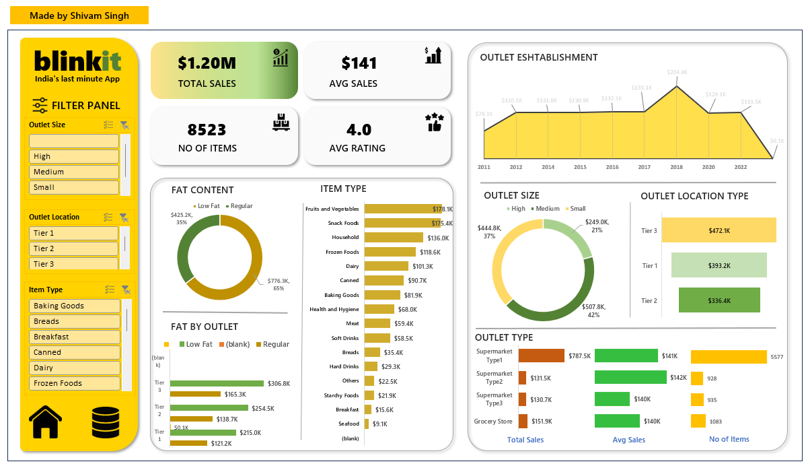

# 🛒 BlinkIT Grocery Sales Analysis – Data Analytics Project

A full-stack data analytics project using **SQL**, **Excel**, **Python**, and **Power BI** to extract actionable insights from BlinkIT grocery sales data. This end-to-end solution highlights sales performance across product types, outlets, and customer preferences using KPIs and visual dashboards.

---

## 📌 Objective

Analyze and visualize BlinkIT's grocery data to:
- Identify top-performing item categories
- Understand the impact of outlet type, size, and location on sales
- Compare sales by fat content and customer ratings
- Build interactive dashboards for management reporting

---

## 🔧 Tech Stack

| Tool | Purpose |
|------|---------|
| **MySQL** | Data querying, cleaning, aggregations |
| **Excel** | Data structuring, formula-based preprocessing |
| **Python (Jupyter Notebook)** | Data manipulation, visualizations |
| **Power BI** | Final KPI dashboards and storytelling |

---

## 📊 KPIs Tracked

| KPI | Description |
|-----|-------------|
| **Total Sales** | Overall revenue (in millions) |
| **Average Sales** | Mean sales per product |
| **Number of Items Sold** | Count of records/products sold |
| **Average Rating** | Mean customer rating per item |
| **Sales by Fat Content** | Comparison of Low Fat vs Regular |
| **Sales by Item Type** | Top 5 high-performing grocery categories |
| **Sales by Outlet Type / Location / Size** | Market segmentation and footprint insights |
| **Sales Trends by Year** | Retail growth pattern based on establishment year |

---

## 📈 Dashboard Preview




## 🧮 Sample SQL Queries

```sql
-- Total Sales in Millions
SELECT CAST(SUM(Sales) / 1000000 AS DECIMAL(10,2)) AS Total_Sales_Millions
FROM blinkit_db.blinkit_grocery_data;

-- KPI: Average Rating
SELECT CAST(AVG(Rating) AS DECIMAL(10,2)) AS Avg_Rating
FROM blinkit_db.blinkit_grocery_data;

-- Sales by Item Type (Top 5)
SELECT Item_Type, SUM(Sales) AS Total_Sales
FROM blinkit_db.blinkit_grocery_data
GROUP BY Item_Type
ORDER BY Total_Sales DESC
LIMIT 5;
